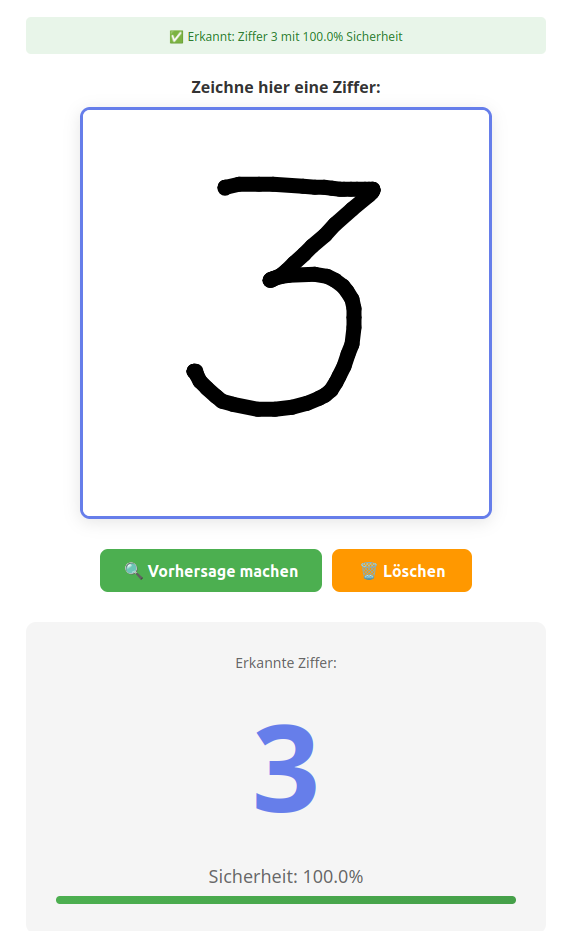

# Deep Learning Kurs: Handschrifterkennung
## Ein vollständiger Kurs für Gymnasium Klasse 8+ (Deutsch)

Dieser Kurs führt Schülerinnen und Schüler in die faszinierende Welt der künstlichen Intelligenz und Deep Learning ein. 
Durch praktische Experimente und Hände-an-der-Tastatur Übungen werden Sie ein funktionsfähiges System zur Erkennung von handgeschriebenen Ziffern (0-9) bauen.

---



## Projektstruktur

```
/
├── docs/                          # Alle Kursmaterialien
    ├── Skript.pdf
│
└── code/                            # Alle Python/Jupyter Code
    ├── 01_Bilder_verstehen.ipynb
    ├── 02_perzeptron.ipynb
    ├── 03_Nichtlinearitaet_Aktivierungsfunktionen.ipynb
    ├── 04_Erstes_Netzwerk.ipynb
    ├── 05_experiments.ipynb
    ├── 06_final_model.ipynb
    ├── digit_recognition_app.py
    ├── final_mnist_model.h5
    ├── templates
    │   └── digit_app.html
    └── requirements.txt             # Python-Abhängigkeiten
```


---

## Kursübersicht

### **Tail 1: Grundlagen der Bilderkennung**

#### Einführung - Wie funktioniert Bilderkennung?
- Was ist Bilderkennung?
- Wie speichert ein Computer Bilder? (Schwarzweiß, Graustufenbilder, RGB)
- Der MNIST-Datensatz (70,000 handgeschriebene Ziffern)
- **Praktische Übung:** Bilder als Tabellen von Zahlen visualisieren

#### Praktische Probleme - Das Klassifizierungsproblem
- Warum naive Lösungen nicht funktionieren
- Musterabgleich, Merkmalserkennung, Schwellenwerte
- Die brillante Idee: Maschinelles Lernen
- **Praktische Übung:** Bilder nach Ähnlichkeit vergleichen

#### Künstliche Neuronen - Die Grundlagen der KI
- Biologie des Gehirns vs. künstliche Neuronen
- Das McCulloch-Pitts Neuron (1943)
- Aktivierungsfunktionen: Sigmoid, ReLU, Tanh
- Mehrschichtige Netze und Backpropagation
- **Praktische Übung:** Mit einem einfachen Neuron experimentieren

#### Das MNIST-Dataset - Erste Experimente
- MNIST laden und erkunden
- k-NN Klassifizierer (96-97% Genauigkeit)
- Decision Trees (88-90% Genauigkeit)
- Random Forest (95-96% Genauigkeit)
- **Praktische Übung:** Verschiedene Klassifizierer vergleichen

### **Tail 2: Neuronale Netze trainieren**

#### Mehrschichtiges Neuronales Netzwerk bauen
- Netzwerk-Architektur: 784 → 128 → 64 → 10
- Parameter und Aktivierungsfunktionen
- Loss-Funktionen: Cross-Entropy
- Der Adam-Optimierer
- **Praktische Übung:** Erstes Netzwerk trainieren (97% Genauigkeit)

#### Experimente und Tuning
- Schichtengrößen variieren
- Learning Rate einstellen
- Batch Size ändern
- Dropout gegen Overfitting
- **Praktische Übung:** Hyperparameter optimieren

#### Fortgeschrittene Modelle
- Convolutional Neural Networks (CNNs)
- Filter und Feature Maps
- Max Pooling
- Warum CNNs besser für Bilder sind
- **Praktische Übung:** CNN bauen (99.3% Genauigkeit)

---

## Installation und Setup

### Voraussetzungen
- Python 3.8+
- Pip oder Conda
- ~2 GB Speicherplatz für MNIST-Daten

### Installation

1. **Repository klonen oder entpacken:**

2. **Python-Umgebung erstellen (optional aber empfohlen):**
```bash
python -m venv venv
source venv/bin/activate  # Linux/Mac
# oder
venv\Scripts\activate  # Windows
```

3. **Abhängigkeiten installieren:**
```bash
pip install -r code/requirements.txt
```

---

### Jupyter Notebooks starten

**Notebook 1: Bilder verstehen**
```bash
cd code/
jupyter notebook 01_Bilder_verstehen.ipynb
```

**Notebook 2: Erstes Netzwerk trainieren**
```bash
jupyter notebook 05_Erstes_Netzwerk.ipynb
```

### Die interaktive GUI-App starten

Nachdem Sie das Modell trainiert haben (siehe Notebook 2):

```bash
cd code/
python digit_recognition_app.py
```

Ein Fenster öffnet sich, in dem Sie mit der Maus Ziffern zeichnen und das trainierte Netzwerk diese erkennen kann!

## Zusätzliche Ressourcen

### Online-Kurse (Kostenlos)
- [Andrew Ng: Machine Learning Specialization](https://www.coursera.org/specializations/machine-learning-introduction) (Coursera)
- [Fast.ai: Practical Deep Learning for Coders](https://course.fast.ai/)
- [DeepLearning.AI Short Courses](https://www.deeplearning.ai/short-courses/)
- [3Blue1Brown: But what is a neural network? | Deep learning chapter 1 ](https://www.youtube.com/watch?v=aircAruvnKk)

### Bücher
- "Deep Learning" von Goodfellow, Bengio, Courville (Das "Bible" des Deep Learning)
- "Hands-On Machine Learning" von Aurélien Géron (Praktisch orientiert)
- "Neural Networks from Scratch" von Harrison Kinney (Implementierung verstehen)
- "Machine Learning mit Python: Das Praxis-Handbuch für Data Science, Predictive Analytics und Deep Learning" von Sebastian Raschka
- [Neural networks and deep learning](http://neuralnetworksanddeeplearning.com/), volume 25. Determination press San Francisco, CA, USA, 2015.  Michael A Nielsen. 

### Online-Ressourcen
- [Papers with Code](https://paperswithcode.com/) - State-of-the-art Modelle
- [TensorFlow Documentation](https://www.tensorflow.org/learn)
- [PyTorch Documentation](https://pytorch.org/docs/stable/index.html)
- [Hugging Face](https://huggingface.co/) - Vortrainierte Modelle

### Datasets zum Experimentieren
- **MNIST:** Handgeschriebene Ziffern (einfach)
- **EMNIST:** Handgeschriebene Ziffern + Buchstaben
- **CIFAR-10:** Kleine Farbbilder von 10 Objektklassen
- **CIFAR-100:** Kleine Farbbilder von 100 Objektklassen
- **Fashion-MNIST:** Wie MNIST aber mit Kleidungsstücken statt Ziffern
- **ImageNet:** Millionen von Fotos (schwer)

---

## Projekt-Ideen für Studierende

Nach dem Kurs können Studierende folgende Projekte versuchen:

1. **Buchstabenerkennung:** Trainiere mit EMNIST für A-Z
2. **Handschrifterkennung für Namen:** Erkenne ganze Wörter statt einzelne Ziffern
3. **Objekt-Klassifikation:** Nutze CIFAR-10 um verschiedene Tiere/Objekte zu erkennen
4. **Transfer Learning:** Fine-tune ein vortrainiertes Model für eine neue Aufgabe
5. **Image Generation:** Generative Adversarial Networks (GANs) zum Erzeugen neuer Ziffern
6. **Smartphone-App:** Packe das Modell in eine mobile App
7. **Vergleich von Architekturen:** Trainiere verschiedene Modelle und vergleiche sie
8. **Robustheit-Studie:** Systematisch testen, wie robust das Modell ist

---

## Lizenz und Attribution

Diese Materialien sind erstellt für Bildungszwecke.

**Verwendete Datensätze:**
- MNIST: Yann LeCun et al. (1998)
- CIFAR-10/100: Alex Krizhevsky

**Frameworks:**
- TensorFlow/Keras: Google
- JAX: High performance array computing
- Jupyter: Project Jupyter
- Python: Python Software Foundation


